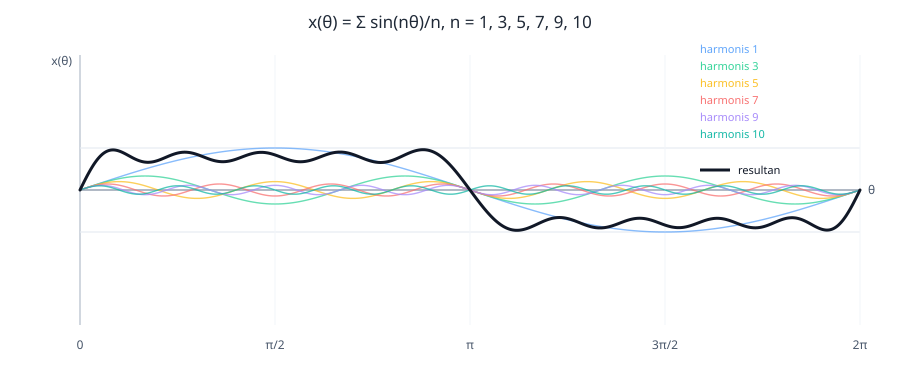

# Tugas 3 — Visualisasi Penjumlahan Sinyal Harmonisa

Soal meminta visualisasi deret harmonisa `1, 3, 5, 7, 9, 10` menggunakan Python. Dengan asumsi amplitudo harmonisa ke-\(n\) adalah \(1/n\), sinyal resultan didefinisikan:

\[
x(\theta)=\sum_{n\in\{1,3,5,7,9,10\}}\frac{\sin(n\theta)}{n}
\]

Harmonis ke-10 tetap dimasukkan sesuai soal meskipun indeks lainnya ganjil. Script Python mandiri (hanya menggunakan standard library) menggambar setiap komponen serta hasil penjumlahannya.



Jalankan dari direktori ini untuk membuat ulang gambar:

```bash
python3 visualisasi_harmonisa.py
```

Script menghasilkan `harmonisa-1-3-5-7-9-10.svg`. Kurva resultan adalah jumlah titik demi titik dari enam sinyal sinusoidal tersebut; perubahan amplitudo dan bentuknya terlihat dari kontribusi masing-masing komponen.
