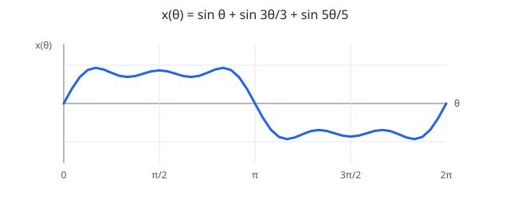

# Tugas 3 — Visualisasi Penjumlahan Sinyal Harmonis

Harmonisa adalah komponen sinusoidal yang frekuensinya merupakan kelipatan bilangan bulat dari frekuensi dasar. Untuk menunjukkan penjumlahan harmonisa ganjil ke-1, ke-3, dan ke-5, gunakan:

\[
x(t)=\sin(2\pi ft)+\frac{1}{3}\sin(2\pi(3f)t)+\frac{1}{5}\sin(2\pi(5f)t)
\]

Dengan sudut fase \(\theta=2\pi ft\):

\[
x(\theta)=\sin\theta+\frac{1}{3}\sin(3\theta)+\frac{1}{5}\sin(5\theta)
\]

Grafik menunjukkan hasil penjumlahan selama satu periode. Harmonis ke-3 memiliki frekuensi tiga kali frekuensi dasar dan amplitudo sepertiganya; harmonis ke-5 memiliki frekuensi lima kali dan amplitudo seperlimanya.

Contoh pada \(\theta=\pi/2\):

\[
x(\pi/2)=\sin(\pi/2)+\frac{1}{3}\sin(3\pi/2)+\frac{1}{5}\sin(5\pi/2)
=1-\frac{1}{3}+\frac{1}{5}=\frac{13}{15}\approx0{,}867
\]

Penjumlahan harmonisa ganjil dengan amplitudo berbanding terbalik terhadap nomor harmonisanya membentuk pendekatan gelombang kotak. Penambahan lebih banyak harmonisa membuat bentuknya semakin menyerupai gelombang kotak, walaupun di sekitar diskontinuitas masih muncul overshoot (fenomena Gibbs).